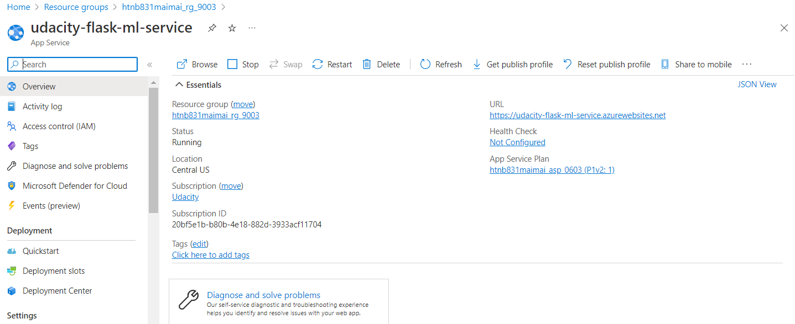

[](https://github.com/briannguyenhtnb/udacity-azuredevops-project2/actions/workflows/python-publish.yml)

# Overview

These projects will show you how to set up Continous Integration with Github Actions and Continous Deployment with Azure Pipelines. The first one project is living on the ```github-actions``` branch and it will be used to demo CI with Github Actions. The second one project is living on the ```main``` branch, it will be used to demo Continuous delivery by using Azure DevOps Pipelines.

## Project Plan

* [Link to a Trello board for the project](https://trello.com/b/2dIg2sPk/flask-ml-service)
* [Link to a spreadsheet that includes the original and final project plan](https://docs.google.com/spreadsheets/d/1H4LCgfTe1PfxhTLpWj3LwC1k_zB-vXn9TTgFLwmq2rA/edit?usp=sharing)

## Continuous Integration with Github Actions
This project is living on ```github-actions``` branch. It is just a simple project to demo CI by using Github Actions

### Architectural Diagram


### Instructions
* Create a ssh keypair and put it into your github, and then clone your repo by using ssh authentication


* Checkout into a new branch ```git checkout -b github-actions```
* Copy following files from my repo:
    ```bash
    |__Makefile
    |__hello.py
    |__test_hello.py
    |__requirements.txt
    ```
* Test and verify output of testing by running command ```make all```

* Push your changes to your repo
    ```bash
    git add .
    git commit -m "init source code"
    git push --set-upstream orgin github-actions
    ```
* Enable Github Actions on your repo. Reference this [link](https://docs.github.com/en/repositories/managing-your-repositorys-settings-and-features/enabling-features-for-your-repository/managing-github-actions-settings-for-a-repository)
* Output of continuous integration with Github Actions 


## CICD with Azure DevOps Pipeline
This project is living on ```main``` branch.
### Architectural Diagram 


### Instructions

* Project cloned into Azure Cloud Shell


* Project running on Azure App Service. Run the command below to deploy the project into an Azure App Service

    ```az webapp up -n <your-app-name>```
    
    Then here is the output of the command
    
    You can check to verify if the webapp service created on Azure portal
    
    Follow the URL from the output in the console you can verify if your app has been deployed successfully
    

* Continue by setting up CI/CD with Azure DevOps Pipelines. Reference the [link](https://docs.microsoft.com/en-us/azure/devops/pipelines/ecosystems/python-webapp?view=azure-devops)

* So now whenever you make any change and push it into the repo, the pipeline you just created above will handle deploying your change to the Azure App Service


* Successful prediction from deployed flask app in Azure Cloud Shell.  [Use this file as a template for the deployed prediction](https://github.com/udacity/nd082-Azure-Cloud-DevOps-Starter-Code/blob/master/C2-AgileDevelopmentwithAzure/project/starter_files/flask-sklearn/make_predict_azure_app.sh).
The output should look similar to this:


* To see streamed log files from deployed application, we can use this command

    ```az webapp log tail```
    
    Output of the command above
    


## Enhancements
* With the first project on the ```github-actions``` branch, I have a plan to dockerize the project.
* With the second project on the ```main``` branch, I would like to create a new beautiful UI with a page of API documents. It will help the website looks friendly and everyone will have a good experience with this.

## Demo 

[Link Screencast on YouTube](https://youtu.be/MeTFf9CD8TU)


